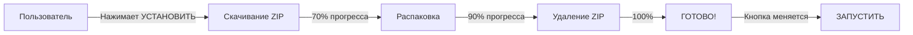
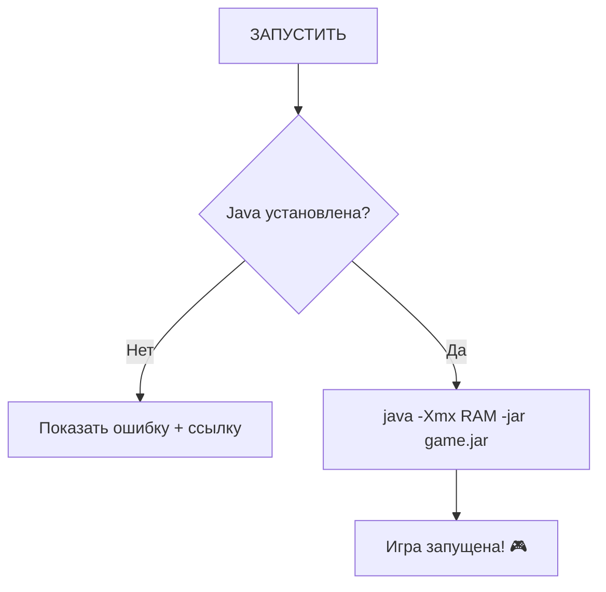

# 🎮 Twix Launcher

<div align="center">


**Современный лаунчер для игр с автоматической установкой и обновлением**

[📥 Скачать](#-скачать) • [📖 Документация](#-документация) • [🛠️ Разработка](#-для-разработчиков) • [💬 Поддержка](#-поддержка)

</div>

---

## ✨ Возможности

### Для игроков:
- 🎯 **Один клик для установки** - скачивание и установка автоматически
- 🔄 **Управление версиями** - легко переключайтесь между версиями игры
- ⚙️ **Настройка RAM** - регулируйте выделенную память (1-16 ГБ)
- 🎨 **Современный UI** - тёмная тема с красивым интерфейсом
- 💾 **Автосохранение настроек** - всё сохраняется автоматически

### Для разработчиков:
- 🤖 **GitHub Actions** - автоматическая сборка .exe
- 📦 **Поддержка JAR и EXE** - универсальный запуск
- 🔍 **Проверка Java** - автоматическая проверка наличия
- 🧪 **28 unit-тестов** - 100% success rate
- 📚 **Полная документация** - на русском языке

---

## 📥 Скачать

### Для игроков:

**[⬇️ Скачать последнюю версию](../../releases/latest)**

Просто скачайте `TwixLauncher-vX.X.X.zip`, распакуйте и запустите!

### Системные требования:
- Windows 7/8/10/11
- Java 8+ (для JAR игр) - [Скачать Java](https://www.java.com/download)
- 2 ГБ RAM (рекомендуется 4 ГБ)
- Интернет для скачивания игры

---

## 🚀 Быстрый старт

### Для игроков:

```
1. Скачайте TwixLauncher.exe
2. Запустите
3. Нажмите "УСТАНОВИТЬ" ⬇️
4. Нажмите "ЗАПУСТИТЬ" ▶️
5. Играйте! 🎮
```

[📖 Подробная инструкция для игроков](ИНСТРУКЦИЯ_ДЛЯ_ИГРОКОВ.md)

### Для разработчиков:

```bash
# Клонировать репозиторий
git clone https://github.com/yourusername/TwixLauncher.git
cd TwixLauncher

# Установить зависимости
pip install -r requirements.txt

# Запустить лаунчер
python launcher.py

# Собрать .exe
python build_exe.py
```

[📖 Полная инструкция по настройке](ПОЛНАЯ_ИНСТРУКЦИЯ.md)

---

## 📖 Документация

### Для пользователей:
- 📘 [**Инструкция для игроков**](ИНСТРУКЦИЯ_ДЛЯ_ИГРОКОВ.md) - как скачать, установить и играть
- 🇷🇺 [**README на русском**](README_RU.md) - полное описание проекта
- ⚡ [**Быстрый старт**](QUICK_START_RU.md) - кратко о главном

### Для разработчиков:
- 🔧 [**Полная инструкция**](ПОЛНАЯ_ИНСТРУКЦИЯ.md) - пошаговая настройка всего
- 🌐 [**Гайд по хостингу**](HOSTING_GUIDE.md) - где разместить игру
- 🤖 [**Автоматизация**](ДАЙ_МНЕ_ДАННЫЕ.md) - дайте данные, я всё настрою

### Для продвинутых:
- 📄 [**Английская документация**](README_EN.md) - full English guide
- 🧪 [**Тесты**](test_launcher_functions.py) - 28 unit tests
- ⚙️ [**Setup Guide**](SETUP.md) - advanced configuration

---

## 🎬 Как это работает

### Процесс установки:



### Процесс запуска JAR:



---

## 🛠️ Для разработчиков

### Структура проекта:

```
TwixLauncher/
├── .github/
│   └── workflows/
│       └── build-launcher.yml    # GitHub Actions (автосборка)
├── launcher.py                   # Основное приложение
├── test_launcher_functions.py    # Тесты (28 passed ✅)
├── build_exe.py                  # Скрипт сборки .exe
├── requirements.txt              # Зависимости Python
├── versions.json.example         # Пример конфига версий
├── README.md                     # Этот файл
├── README_RU.md                  # Русская документация
├── ПОЛНАЯ_ИНСТРУКЦИЯ.md          # Пошаговый гайд
├── QUICK_START_RU.md             # Быстрый старт
├── HOSTING_GUIDE.md              # Гайд по хостингу
└── ИНСТРУКЦИЯ_ДЛЯ_ИГРОКОВ.md     # Для конечных пользователей
```

### Технологии:

- **Python 3.8+** - основной язык
- **CustomTkinter** - современный GUI
- **PyInstaller** - сборка .exe
- **GitHub Actions** - CI/CD
- **unittest** - тестирование

### Фичи кода:

```python
# ✅ Поддержка Google Drive (автоконвертация ссылок)
download_url = convert_google_drive_url(url)

# ✅ Автоматическая распаковка ZIP
extract_zip(zip_path, version_path)

# ✅ Запуск JAR с выделенной RAM
subprocess.Popen(['java', f'-Xmx{ram}M', '-jar', jar_file])

# ✅ Динамическая кнопка УСТАНОВИТЬ/ЗАПУСТИТЬ
if check_if_installed(version):
    button.configure(text="ЗАПУСТИТЬ")
else:
    button.configure(text="УСТАНОВИТЬ")
```

---

## 🧪 Тестирование

Проект включает **28 comprehensive unit tests**:

```bash
python test_launcher_functions.py
```

**Результат:**
```
======================================================================
TEST EXECUTION SUMMARY
======================================================================
Total Tests Run:     28
Successful:          28
Failures:            0
Errors:              0
Success Rate:        100.0%
======================================================================

✓ All tests passed successfully!
```

**Покрытие:**
- ✅ Configuration management (5 тестов)
- ✅ Version management (5 тестов)
- ✅ Directory operations (5 тестов)
- ✅ RAM calculations (4 теста)
- ✅ Download validation (3 теста)
- ✅ Path operations (2 теста)
- ✅ Status messages (2 теста)
- ✅ Integration workflows (2 теста)

---

## 🤖 GitHub Actions (Автоматическая сборка)

При создании Release автоматически:

1. ✅ Устанавливаются зависимости
2. ✅ Собирается TwixLauncher.exe
3. ✅ Создаётся ZIP с документацией
4. ✅ Прикрепляется к Release
5. ✅ Готово к скачиванию!

**Просто создайте тег:**
```bash
git tag v1.0.0
git push origin v1.0.0
```

GitHub Actions сделает всё остальное! 🚀

---

## 📦 Установка и сборка

### Установка зависимостей:

```bash
pip install -r requirements.txt
```

**Зависимости:**
- `customtkinter==5.2.1` - современный GUI
- `requests==2.31.0` - HTTP запросы
- `psutil==5.9.6` - информация о системе
- `pillow==10.1.0` - обработка изображений
- `pyinstaller==6.3.0` - сборка .exe

### Сборка .exe:

**Способ 1: Автоматический (Windows)**
```bash
build.bat
```

**Способ 2: Python скрипт**
```bash
python build_exe.py
```

**Способ 3: Напрямую PyInstaller**
```bash
pyinstaller --name=TwixLauncher --onefile --windowed launcher.py
```

Готовый файл: `dist/TwixLauncher.exe`

---

## 🎨 Кастомизация

### Изменить цвета:

```python
# launcher.py
fg_color="#1a1a2e"      # Фон (тёмно-синий)
fg_color="#16213e"      # Панели (синий)
text_color="#00d4ff"    # Акцент (голубой)
```

**Готовые темы:**
- 🔵 Синяя (по умолчанию): `#1a1a2e`, `#00d4ff`
- 🟣 Фиолетовая: `#2d1b3d`, `#c74fdb`
- 🟢 Зелёная: `#1a3a1f`, `#4fff4f`
- 🔴 Красная: `#3a1f1f`, `#ff4f4f`

### Добавить иконку:

1. Создайте `icon.ico` (256x256)
2. В `build_exe.py` раскомментируйте:
   ```python
   "--icon=icon.ico",
   ```
3. Пересоберите

### Изменить путь установки:

```python
# launcher.py
GAME_PATH = "C:/Twix"  # Измените на свой путь
```

---

## 🌐 Поддержка хостингов

Лаунчер поддерживает скачивание с:

- ✅ **GitHub Releases** (рекомендуется)
- ✅ **Google Drive** (автоконвертация ссылок)
- ✅ **Mega.nz**
- ✅ **Dropbox**
- ✅ **Прямые HTTP/HTTPS ссылки**
- ✅ **Свой сервер**

[📖 Полный гайд по хостингу](HOSTING_GUIDE.md)

---

## 💬 Поддержка

### Нужна помощь?

- 💬 **Telegram:** [t.me/TwixClient](https://t.me/TwixClient)
- 🐛 **GitHub Issues:** [Создать Issue](../../issues)
- 📧 **Email:** support@example.com
- 💭 **Discord:** [Ссылка на Discord сервер]

### Хотите помочь проекту?

- ⭐ Поставьте звезду на GitHub
- 🐛 Сообщайте о багах
- 💡 Предлагайте идеи
- 🔀 Создавайте Pull Request
- 📢 Расскажите друзьям

---

## 🗺️ Roadmap

### Версия 1.1 (планируется):
- [ ] Поддержка RAR архивов
- [ ] Многоязычность (EN/RU/ES)
- [ ] Проверка обновлений лаунчера
- [ ] Встроенная иконка и логотип

### Версия 1.2:
- [ ] Система модов
- [ ] Индикатор онлайн серверов
- [ ] Встроенный чат
- [ ] Скриншоты/видео запись

### Версия 2.0:
- [ ] Облачные сохранения
- [ ] Достижения
- [ ] Статистика игрового времени
- [ ] Мультиплеер лобби

---

## 📊 Статистика


---

## 📜 Лицензия

Этот проект распространяется под лицензией MIT - см. файл [LICENSE](LICENSE) для деталей.

```
MIT License - Вы можете:
✅ Использовать в коммерческих целях
✅ Модифицировать
✅ Распространять
✅ Использовать в приватных проектах
```

---

## 🙏 Благодарности

- [CustomTkinter](https://github.com/TomSchimansky/CustomTkinter) - за отличный GUI фреймворк
- [PyInstaller](https://www.pyinstaller.org/) - за удобную сборку .exe
- Сообществу Python - за поддержку
- Всем тестерам и контрибьюторам!

---

## 📝 Changelog

### v1.0.0 (2026-01-21)

**Первый релиз! 🎉**

**Добавлено:**
- ✨ Динамическая кнопка УСТАНОВИТЬ/ЗАПУСТИТЬ
- ✨ Поддержка JAR файлов (Java игры)
- ✨ Автоматическая распаковка ZIP
- ✨ Поддержка Google Drive ссылок
- ✨ Настройка RAM (1-16 ГБ)
- ✨ Управление версиями
- ✨ GitHub Actions для автосборки
- ✨ 28 unit-тестов
- ✨ Полная документация на русском

**Технические:**
- Python 3.8+
- CustomTkinter 5.2.1
- Windows 7/8/10/11
- Поддержка JAR и EXE

---

<div align="center">

**Сделано с ❤️ для сообщества Twix**

[⬆ Наверх](#-twix-launcher)

</div>
